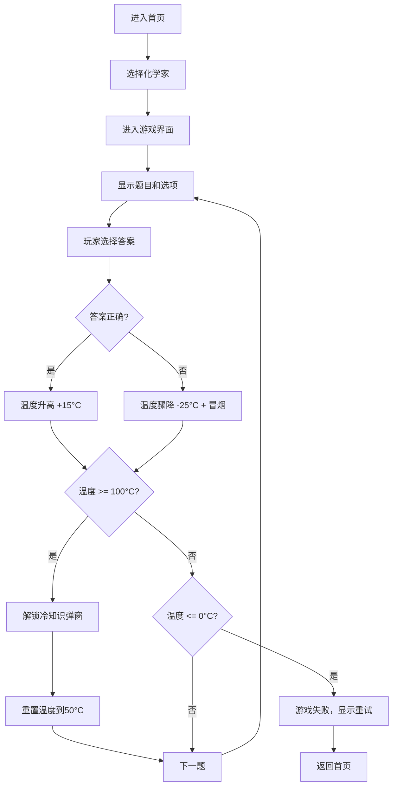

## 1. 产品概述

炼金失控反应炉是一款以化学史为主题的Web知识问答小游戏，玩家通过"配方配平"玩法学习化学史上的经典反应与物质，答对升温答错降温，解锁冷知识奖励。

- 核心玩法：化学史知识问答，围绕波义耳、拉瓦锡、门捷列夫三位化学家的历史贡献展开
- 目标用户：学生、化学爱好者、喜欢科普小游戏的普通用户
- 产品价值：寓教于乐，在游戏中学习化学史知识

## 2. 核心功能

### 2.1 用户角色

| 角色 | 注册方式 | 核心权限 |
|------|----------|----------|
| 玩家 | 无需注册，直接进入 | 选择化学家、答题、查看冷知识、重新开始游戏 |

### 2.2 功能模块

1. **首页/化学家选择页**：游戏标题、三位化学家角色卡片、开始游戏按钮
2. **游戏主界面**：反应炉可视化、温度条、当前题目、选项按钮、反馈动画
3. **冷知识解锁页**：展示解锁的化学史冷知识、继续游戏或返回首页选项

### 2.3 页面详情

| 页面名称 | 模块名称 | 功能描述 |
|----------|----------|----------|
| 首页 | 化学家选择 | 展示三位化学家头像和简介，点击选择后开始游戏 |
| 游戏页 | 反应炉组件 | 显示温度条、火焰/冒烟动画效果、温度数值 |
| 游戏页 | 题目区 | 显示当前历史反应/物质描述、四个选项按钮 |
| 游戏页 | 反馈效果 | 答对升温动画、答错降温冒烟动画、正确答案提示 |
| 解锁页 | 冷知识展示 | 精美的卡片展示解锁的化学史冷知识 |

## 3. 核心流程

## 4. 用户界面设计

### 4.1 设计风格

- **主色调**：深褐色 `#2C1810` 作为背景，营造炼金实验室氛围
- **强调色**：
  - 铜金色 `#D4A574` - 炼金炉金属质感
  - 火焰橙 `#FF6B35` - 答对升温效果
  - 烟雾灰 `#6B7280` - 答错降温效果
  - 炼金绿 `#10B981` - 冷知识解锁成功
- **按钮风格**：复古黄铜质感，圆角边框，点击时有按压凹陷效果
- **字体**：标题使用复古衬线字体 'Cinzel Decorative'，正文使用 'Crimson Pro' 衬线字体
- **布局风格**：卡片式布局，带有做旧纹理和轻微的噪点质感
- **图标风格**：炼金术符号风格，使用emoji和SVG图标（⚗️ 🔥 🧪 📜 🔬）

### 4.2 页面设计概述

| 页面名称 | 模块名称 | UI元素 |
|----------|----------|--------|
| 首页 | 化学家选择 | 三张竖排卡片，悬停时发光效果，点击波纹动画，渐变背景 |
| 游戏页 | 反应炉组件 | 居中大型炼金炉SVG，温度条在炉身，火焰粒子动画，烟雾CSS动画 |
| 游戏页 | 题目区 | 羊皮纸质感卡片，四个选项按钮带发光边框，正确/错误反馈动画 |
| 解锁页 | 冷知识展示 | 卷轴展开动画，精美边框，打字机文字效果 |

### 4.3 响应式

- 桌面端优先设计，使用Tailwind响应式断点
- 移动端：化学家卡片改为上下排列，反应炉缩小适配屏幕
- 触摸优化：按钮最小高度48px，增加点击区域

### 4.4 动效设计

- 页面加载：元素淡入+上移， staggered 延迟效果
- 答对：火焰喷发动画，温度条渐变填充，+15°C数字跳动
- 答错：屏幕震动，烟雾粒子从炉口冒出，温度条骤降
- 冷知识解锁：卷轴展开，背景光效扩散，打字机效果显示文字
