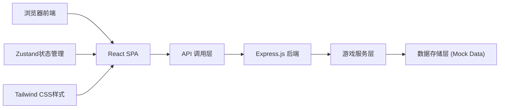
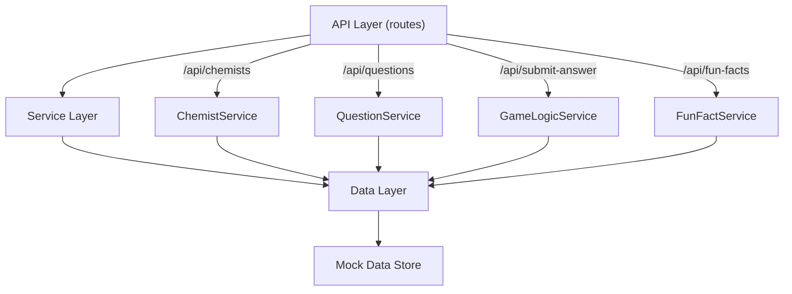
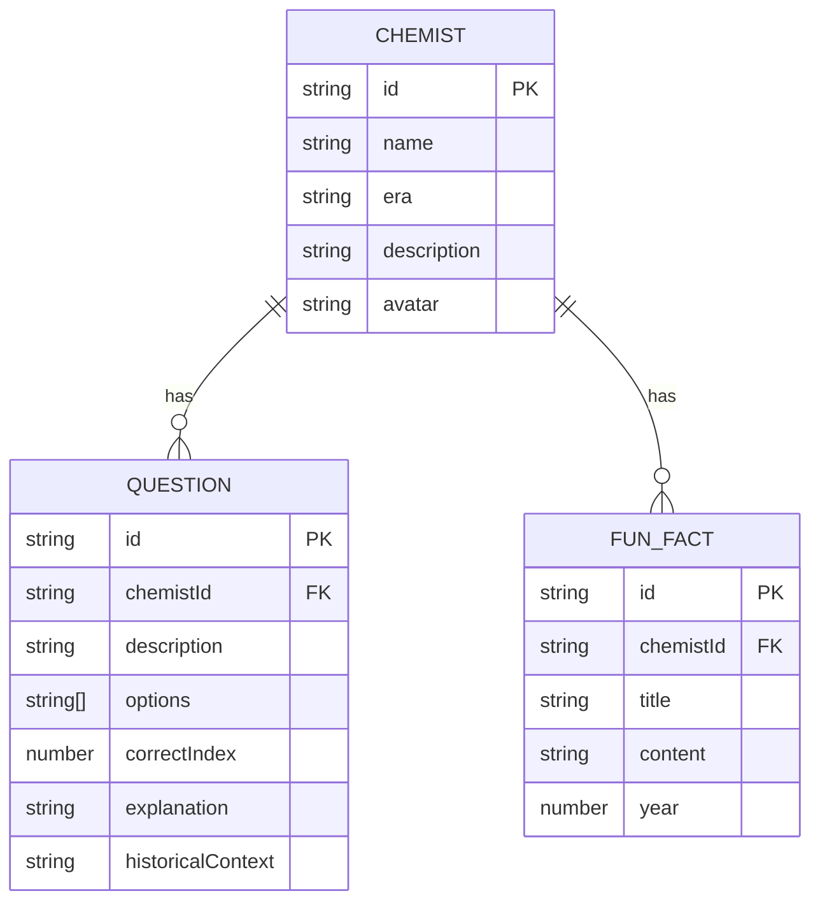

## 1. 架构设计



## 2. 技术描述

- **前端**：React@18 + TypeScript + Vite + tailwindcss@3 + zustand + react-router-dom
- **后端**：Express@4 + TypeScript
- **数据层**：内存Mock数据（化学史题库、冷知识库）
- **初始化工具**：vite-init
- **包管理器**：npm

## 3. 路由定义

| 路由 | 用途 |
|------|------|
| / | 首页，化学家选择 |
| /game | 游戏主界面 |
| /unlock | 冷知识解锁页 |

## 4. API 定义

### 类型定义

```typescript
// 化学家类型
interface Chemist {
  id: string;
  name: string;
  era: string;
  description: string;
  avatar: string;
}

// 题目类型
interface Question {
  id: string;
  chemistId: string;
  description: string;
  options: string[];
  correctIndex: number;
  explanation: string;
  historicalContext: string;
}

// 冷知识类型
interface FunFact {
  id: string;
  chemistId: string;
  title: string;
  content: string;
  year?: number;
}

// 答题请求
interface SubmitAnswerRequest {
  questionId: string;
  selectedIndex: number;
  currentTemperature: number;
}

// 答题响应
interface SubmitAnswerResponse {
  isCorrect: boolean;
  correctIndex: number;
  explanation: string;
  newTemperature: number;
  shouldUnlock: boolean;
  unlockedFact?: FunFact;
  nextQuestion?: Question;
}
```

### API 端点

| 方法 | 路径 | 描述 |
|------|------|------|
| GET | /api/chemists | 获取化学家列表 |
| GET | /api/questions/:chemistId | 获取指定化学家的随机题目 |
| POST | /api/submit-answer | 提交答案 |
| GET | /api/fun-facts/random | 随机获取冷知识 |
| GET | /api/fun-facts/:chemistId | 获取指定化学家的冷知识 |

## 5. 服务器架构图



## 6. 数据模型

### 6.1 数据模型定义



### 6.2 初始化数据

```typescript
// 化学家数据
const chemists = [
  {
    id: 'boyle',
    name: '罗伯特·波义耳',
    era: '1627-1691',
    description: '近代化学之父，提出化学元素概念',
    avatar: '⚗️'
  },
  {
    id: 'lavoisier',
    name: '安托万·拉瓦锡',
    era: '1743-1794',
    description: '现代化学之父，确立质量守恒定律',
    avatar: '🔥'
  },
  {
    id: 'mendeleev',
    name: '德米特里·门捷列夫',
    era: '1834-1907',
    description: '元素周期表发明者',
    avatar: '📊'
  }
];

// 题目数据 - 波义耳
const boyleQuestions = [
  {
    id: 'boyle-q1',
    chemistId: 'boyle',
    description: '波义耳在1661年出版的著作，标志着近代化学的开端，这本书是？',
    options: [
      '《怀疑的化学家》',
      '《化学原理》',
      '《元素论》',
      '《炼金指南》'
    ],
    correctIndex: 0,
    explanation: '《怀疑的化学家》是波义耳最著名的著作，书中批判了炼金术的元素学说。',
    historicalContext: '1661年，波义耳提出化学不是医学或炼金术的附属，而是一门独立的科学。'
  },
  {
    id: 'boyle-q2',
    chemistId: 'boyle',
    description: '波义耳提出的著名气体定律是关于气体哪两个性质之间的关系？',
    options: [
      '温度与体积',
      '压强与体积',
      '密度与压强',
      '温度与压强'
    ],
    correctIndex: 1,
    explanation: '波义耳定律指出：在恒温下，一定量气体的体积与压强成反比。',
    historicalContext: '这是人类历史上发现的第一个"定律"——用数学公式描述的自然规律。'
  },
  {
    id: 'boyle-q3',
    chemistId: 'boyle',
    description: '波义耳认为元素的正确定义是什么？',
    options: [
      '由火、水、土、气四元素组成',
      '不能再分解的简单物质',
      '由原子构成的物质',
      '具有固定熔点的物质'
    ],
    correctIndex: 1,
    explanation: '波义耳将元素定义为"不能再分解的简单物质"，推翻了古希腊四元素说。',
    historicalContext: '这一观点为后来的化学元素研究奠定了基础。'
  }
];

// 题目数据 - 拉瓦锡
const lavoisierQuestions = [
  {
    id: 'lavoisier-q1',
    chemistId: 'lavoisier',
    description: '拉瓦锡通过加热氧化汞分解实验，发现了什么气体？',
    options: [
      '氮气',
      '氢气',
      '氧气',
      '二氧化碳'
    ],
    correctIndex: 2,
    explanation: '拉瓦锡发现氧化汞加热分解产生的气体能助燃，将其命名为"氧气"。',
    historicalContext: '这个实验推翻了统治化学界百年的"燃素说"，开创了现代化学。'
  },
  {
    id: 'lavoisier-q2',
    chemistId: 'lavoisier',
    description: '拉瓦锡提出的化学反应基本定律是？',
    options: [
      '定比定律',
      '质量守恒定律',
      '倍比定律',
      '气体反应体积定律'
    ],
    correctIndex: 1,
    explanation: '拉瓦锡通过精确的定量实验证明：化学反应前后总质量不变。',
    historicalContext: '他用定量实验方法将化学从定性研究推向定量研究。'
  },
  {
    id: 'lavoisier-q3',
    chemistId: 'lavoisier',
    description: '拉瓦锡将水通过灼热的铁管，发现水可以分解产生什么气体？',
    options: [
      '氧气',
      '氢气',
      '氮气',
      '一氧化碳'
    ],
    correctIndex: 1,
    explanation: '拉瓦锡发现水分解产生氢气，证明水不是元素而是化合物。',
    historicalContext: '这个实验彻底推翻了水是基本元素的古老观念。'
  }
];

// 题目数据 - 门捷列夫
const mendeleevQuestions = [
  {
    id: 'mendeleev-q1',
    chemistId: 'mendeleev',
    description: '门捷列夫是根据元素的什么性质来排列元素周期表的？',
    options: [
      '原子序数',
      '原子量',
      '质子数',
      '电子数'
    ],
    correctIndex: 1,
    explanation: '门捷列夫按照原子量递增的顺序排列元素，发现了元素性质的周期性。',
    historicalContext: '后来莫斯莱发现应该按原子序数排列，但门捷列夫的周期律依然正确。'
  },
  {
    id: 'mendeleev-q2',
    chemistId: 'mendeleev',
    description: '门捷列夫的周期表中预言了"类铝"元素，后来被发现的是？',
    options: [
      '锗',
      '镓',
      '钪',
      '铟'
    ],
    correctIndex: 1,
    explanation: '门捷列夫预言的"类铝"就是后来发现的镓，其性质与预言惊人吻合。',
    historicalContext: '镓是第一种被发现的、门捷列夫预言的元素，这使周期律获得广泛认可。'
  },
  {
    id: 'mendeleev-q3',
    chemistId: 'mendeleev',
    description: '门捷列夫编制元素周期表是在哪一年？',
    options: [
      '1859年',
      '1869年',
      '1879年',
      '1889年'
    ],
    correctIndex: 1,
    explanation: '1869年，门捷列夫正式发表了他的元素周期表。',
    historicalContext: '有趣的是，他是在玩"化学纸牌"游戏时获得灵感排列出元素周期表的。'
  }
];

// 冷知识数据
const funFacts = [
  {
    id: 'fact-1',
    chemistId: 'boyle',
    title: '波义耳与指示剂',
    content: '波义耳是第一个发现酸碱指示剂的人！他无意中将紫罗兰花瓣掉入盐酸中，发现花瓣变红，由此发明了石蕊试纸。',
    year: 1645
  },
  {
    id: 'fact-2',
    chemistId: 'boyle',
    title: '不信炼金术的化学家',
    content: '波义耳出生在一个炼金术盛行的年代，但他却公开质疑炼金术的"点石成金"之说，认为必须通过实验来验证一切。',
    year: 1661
  },
  {
    id: 'fact-3',
    chemistId: 'lavoisier',
    title: '拉瓦锡的断头实验',
    content: '拉瓦锡在法国大革命中被送上断头台。传说他与刽子手约定，头被砍下后尽可能眨眼，以验证人死后是否还有意识。据说他眨了15次眼。',
    year: 1794
  },
  {
    id: 'fact-4',
    chemistId: 'lavoisier',
    title: '21岁的气象学家',
    content: '拉瓦锡从21岁开始，连续15年每天早上4点起床，晚上10点睡觉，坚持记录天气数据，一生中从未间断。',
    year: 1764
  },
  {
    id: 'fact-5',
    chemistId: 'mendeleev',
    title: '被拒绝的诺贝尔奖',
    content: '门捷列夫的元素周期表如此重要，但他却从未获得诺贝尔奖。因为1906年的评委会主席与他有私怨，以"周期表太老"为由否决了他。',
    year: 1906
  },
  {
    id: 'fact-6',
    chemistId: 'mendeleev',
    title: '全能的门捷列夫',
    content: '门捷列夫不仅是化学家，还研究过气象学、地质学、经济学，甚至参与过北极探险。他为俄罗斯的度量衡制度奠定了基础。',
    year: 1899
  }
];
```
